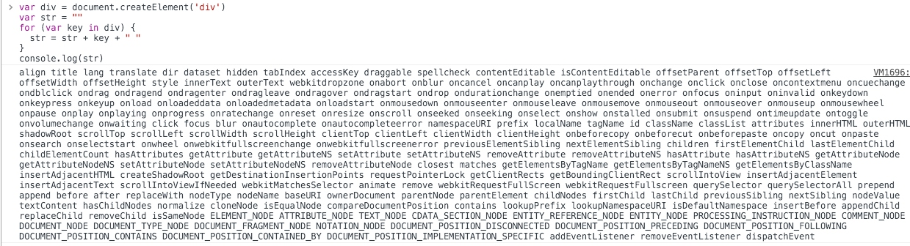
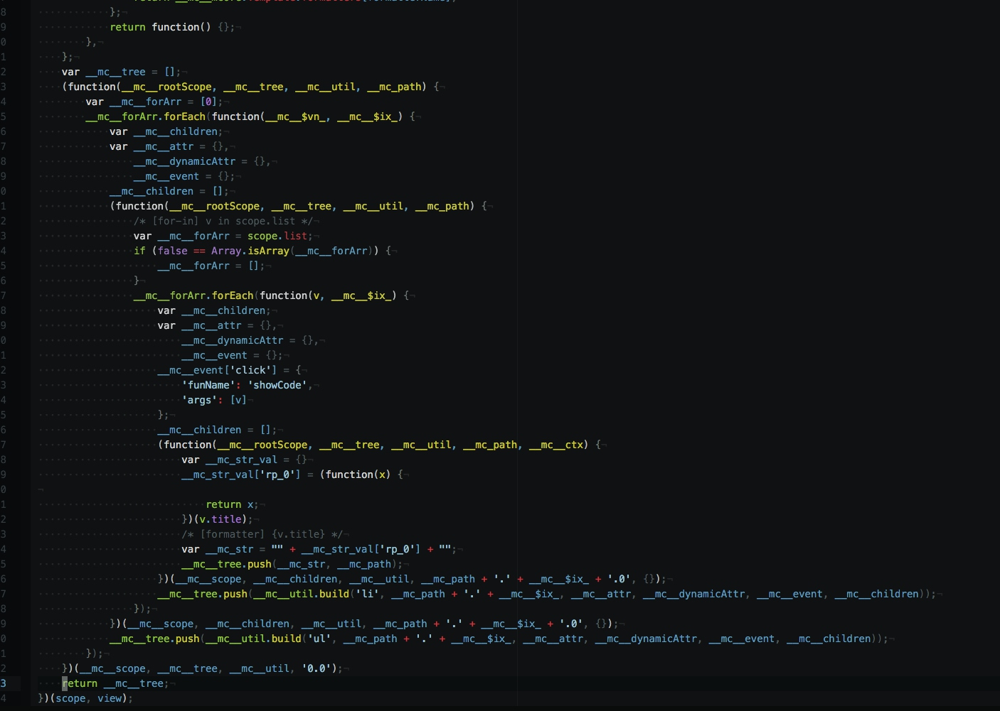

## 将 html 解释成  js (virtual-dom 的定义)

### 关于 virtual DOM diff

这是 **一个** 标准 DOM 的属性


下面是 mcore3 的 **一组**  virtual DOM 定义
```js
let virtualDOMDef = {
    tagName: 'ul', // 节点标签名
    props: { // DOM的静态属性，不需要 watch 变更
        id: 'list'
    },
    dynamicProps: { // DOM的动态属性，需要 watch
        width: '80%'
    },
    events: { // 事件定义
        click: [v.id, v.name] // 事件传递的上下文
    },  
    children: [ // 该节点的子节点
        {tagName: 'li', props: {class: 'item'}, children: ["Item 1"]},
        {tagName: 'li', props: {class: 'item'}, children: ["Item 2"]},
        {tagName: 'li', props: {class: 'item'}, children: ["Item 3"]},
    ]
}
```
> 简化 比较对象 复杂度，是提升性能的一个关键点

那么，问题来了，怎么将 `html` 代码，转换成 上面的 virtual DOM 定义呢？
不可能手写上面的定义吧，那么，就有了这个 `h2svd-loader`.

h2svd-loader 有二个重要的概念
- 静态解释
- 构造 运行时代码 `runtime code`

### 静态解释

先来个简单的例子
```html
<div id="test"></div>
```
先用 `htmlparser2` 解释成一个 JSON 结构
```js
{
    type: 'tag'
    name: 'div'
    attribs: {
        id: 'test'
    }
    children: []
}
```
再解释这个结构，转换成 js 代码
```js
let virtualDOMDef = {
    tagName: 'div', 
    props: { 
        id: 'test'
    },
    dynamicProps: { },
    events: { },  
    children: []
}
```
### 构造 运行时代码 `runtime code`

先上模板
```html
<ul>
    <li mc-for="v in scope.list" mc-on-click="showCode(v)">{v.title}</li>
</ul>
```
解释这个模板，需要依赖两个运行时变量， `scope` `v` ,  及  `view.showCode(event, el, v)` 事件的传递
先看 `htmlparser2` 解释 解释的结构
```js
{
    type: 'tag'
    name: 'ul'
    attribs: {}
    children: [{
            type: 'tag'
            name: 'li'
            attribs: {
                "mc-for": 'v in scope.list'
                "mc-on-click": 'showCode(v)'
            }
            children: [{
                data: '{v.title}'
                type: 'text'
            }]
    }]
}
```
那，就需要传入 `scope`, 跟 `view` 这两个运行时变量，才能生成模板定义
代码结构就是这样
```js
(function(scope, view){
    let tree = [];
    //这里放 dom 定义代码, 代生成一个 dom 定义，就行 tree 里插
    return tree;
})(scope, view);
```
好，js 结构定义好，来生成运行时代码,
当然是先生成 for 代码了， `li` 的数量，根据 `scope.list` 大小来生成
```js
for(let i = 0, len = scope.list; i < len; i++){
    let attr = {}, dynamicAttr = {} children = [], 
    let v = scope.list[i];    // 解释需要的上下文 v in scope.list， 得到 v
    let events = {}; // 初始化一个对象
    events['click'] = { // 解释  "mc-on-click": 'showCode(v)' 得到
        funName: 'showCode',
        args: [v]
    }
    tree.push xxx // 将定义插入树
}
```
当然，上面的理想的代码，实际生成的代码需要考虑很多因素，所以，代码是这样的




### 标签解释优先级
1.	`mc-for`
2.	`mc-if` `mc-unless`
3.	`mc-[attr]` `mc-on-[event]`
4.	`{x | [formatter] arg... | [formatter] arg...}` `{x}`
